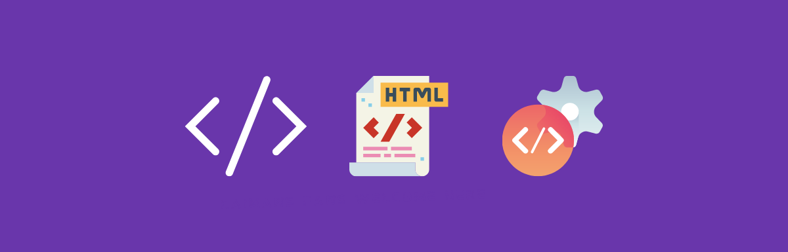

# Comment structurer un code correct : html and css with sementic

En programmation, la sémantique fait référence au sens d'une partie de code — par exemple 
"quel effet aura l'exécution de cette ligne de JavaScript ?", 
ou "quel est le rôle ou le but de cet élément HTML" (plutôt que "à quoi ressemble-t-il ?".) 